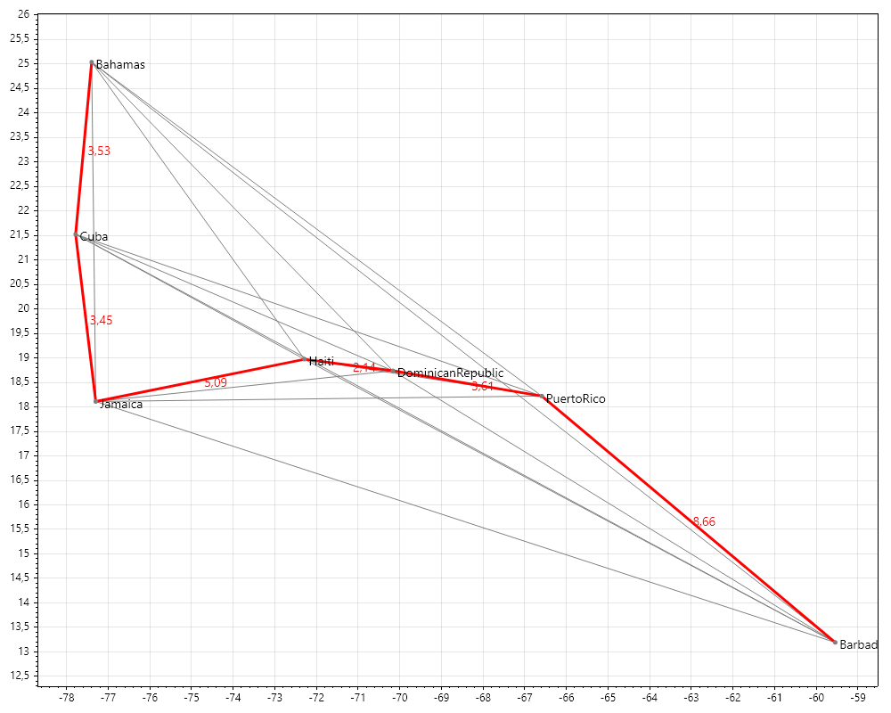

# Report

Course: C# Development SS2026 (4 ECTS, 3 SWS)

Student ID: CC241042

BCC Group: A

Name: Ksawery Kochanowicz

## Methodology: 
For both the Kruskal's default and coordinate solution, as the name suggests, I used Kruskal's Minimum Spanning Tree Algorithm. 

### Changes to the DataStructureLibrary:
In order to implement the Kruskal's MST algorithm, I had to personalize the DS Library. In `KruskalsProperties.cs` I created:
- `public class VertexProperty` that extends `BasicVertexProperty`. It is used for the default solution.
- `public class CoordinatesVertexProperty` that also extends `BasicVertexProperty`. It adds two variables: `public double X; public double Y;`. Those are used to store X and Y coordinates of a vertex.
- `public class EdgeProperty`. Extends `BasicEdgeProperty<Vertex<VertexProperty>>`. Adds a variable `public int Weight` that stores the weight of each edge.
- `public class CoordinatesEdgeProperty`. Extends `BasicEdgeProperty<Vertex<CoordinatesVertexProperty>>`. Adds a variable `public double Length` that stores the weight(length) of each edge.
  
In `Graph.cs`:
- I added `GetVertices()` method that just returns the vertices which are part of the graph


### Assigning weight to edges:
In case of the default solution, each edge has an arbitrary weight assigned. In the coordinate solution the weight of each edge is calculated by measuring the Euclidean distance between two vertices.
The list of edges is then sorted (ascending) based on the weight.

### Disjoint set:
In order to create a disjoint set, a Dictionary `parent` storing: `<Vertex<VertexProperty>>,<Vertex<VertexProperty>>` is initialized. Then each vertex is extracted from the graph, by a function that I added to the graph DS `GetVertices()`, and inserted into the dictionary.

In further steps, the disjoint set is used to detect cycles inside of the potential MST.

### ForEach loop:
Initially, the function picks the smallest edge from edgesList. Then, using the `Find()` method, it checks if the source vertex and the target vertex of the edge already form a cycle in the MST. If not, the vertices are added to the disjoint set (using `Union()` method), and the edge is added as a part of the MST. Then a next edge is selected from the edgesList.

The break condition for this loop is if the amount of edges in the MST is smaller by one than the amount of total vertices in the graph.

### Final Result:
When the foreach loop is finished, the edges that create the Minimal Spanning Tree are returned. 

## Additional Features

### Kruskal's with Coordinates:
This whole solution is an alternative to the default. I decided that I didn't really like the arbitrary aspect of the default solution, and wanted to calculate the MST on actual, 2D coordinates. This solution also serves as a practical application of the the Kruskal's algorithm.

#### Differences from the default solution:
Since the weight of the edges is no longer arbitrary it has to be calculated. Since the vertices have X and Y coordinates, the weight of the edge can be calculated by taking the coordinates of the source and target vertices, and then applying the Euclidean distance formula.

The function also returns the list of all edges and the MSTedges, which is later used to display the MST on a 2D graph.

### Graph generation for the Coordinate Solution
Initially I was considering generating graphs in the terminal, using ASCII signs and representation. However, after experimenting with it a bit, I realized that it was redundant for graphs with large amount of edges. That's why I decided to utilize an external library called `ScottPlot`.

For the graph generation, I created a `CoordinateGraphRendered` class. In it's void function `DrawGraph` it:
- adds all of the edges of to the plot, showing possible connections between vertices
- adds the MST edges, marking them with red color
- adds length (weight) labels to the MST edges
- adds all of the vertices and name labels to the plot
- scales the plot automatically to fit the data. 

Then the plot is saved to a png and stored in `generated_graphs` directory.

## Practical application of the algorithm
### Choosing the idea:
I had a few ideas for the practical application, all of them sharing the same concept: using 2d coordinates and actually edge lengths, instead of arbitrary ones. Ultimately I decided to choose and idea I found interesting while researching the algorithm on the Internet
### The idea:
Let's assume that each vertex represent an island, with the X and Y being the coordinates. All of the vertices together create an archipelago. We want to build a bridge system, in a way that each island has access to each other island. However, in order to preserve building materials, time and money, we want to find a way to connect the island so that there is no cycles. And that's when the Minimal Spanning Tree comes in. The generated 2d graph displays the optimal way of connecting all of the islands, and a total cost in length is calculated
### Constrains
In real life, there are more variables that would have to be considered while choosing the most cost efficient build process such as: water depth, land elevation, importance of each island, shipping paths etc. However, to simplify the problem I assumed the cost is the euclidean distance between each island.

If we want to use real life location some islands, there are a few downsides caused by the simplicity of the solution. X will represent the longitude, Y the latitude. However, because of curvature of the Earth, the bigger the distance, the bigger is the distortion. Because of that, the application works the best if we consider it as map projection, and we use islands relatively close to each other. In any way, the graph should be considered as approximation of real data.

### Usage
In order to demonstrate the capabilities of the practical application, we can use real life location, taking into a count the constrains. As an example, I chose 7 islands from the Caribbean Sea. We can use the Kruskal's Coordinate solution, choosing Long Manual Input to insert the data in the terminal.
Example input:
```bash
7
```
```bash
Cuba -77.7812 21.5218
Jamaica -77.2975 18.1096
Haiti -72.2852 18.9712
DominicanRepublic -70.1627 18.7357
PuertoRico -66.5901 18.2208
Bahamas -77.3963 25.0343
Barbados -59.5432 13.1939
```
#### the Result for this input is:
```
List of edges in the minimum spanning tree: 
Source: Haiti, Target: DominicanRepublic, Length: 2,1355248769330712
Source: Cuba, Target: Jamaica, Length: 3,446313179326567
Source: Cuba, Target: Bahamas, Length: 3,5335257548233634
Source: DominicanRepublic, Target: PuertoRico, Length: 3,6095142013849952
Source: Jamaica, Target: Haiti, Length: 5,085814177690723
Source: PuertoRico, Target: Barbados, Length: 8,65612634034417
Total Minimal Spanning Tree Length: 26,466818530502888
```
And the generated graph looks like:


## Discussion/Conclusion
Initially, it was a challenge to me to understand how exactly does the algorithm calculate the Minimal Spanning Tree. The visualization on the wikipedia page helped a lot, but didn't really make it clear what should the algorithm look in code. I had to research the topic, finally discovering to use a dictionary as a disjoint set. Realizing that the algorithm is quite simple when knowing what data structure to use was a relief. During this research I started to like the project a lot. However, I wasn't a fan of the fact that the values are arbitrary, so from the start I knew I want to implement a solution that uses 2D coordinates.

Another challenge was properly understanding the DataStructureLibrary, and how to extend it to fit my project. However, reviewing the code carefully and coming back to videos from previous lectures allowed me to understand how it works, and properly tune it to my project

Overall, I enjoyed the project a lot, especially the freedom I've got to implement a practical solution of my choosing. Working on the implementation required me to do plenty of additional research, which I feel like improved my knowledge a lot, and also got me hooked on researching different graph traversal algorithms.

## Work with: 
I worked alone

## Reference: 
https://en.wikipedia.org/wiki/Kruskal%27s_algorithm

https://scottplot.net/
